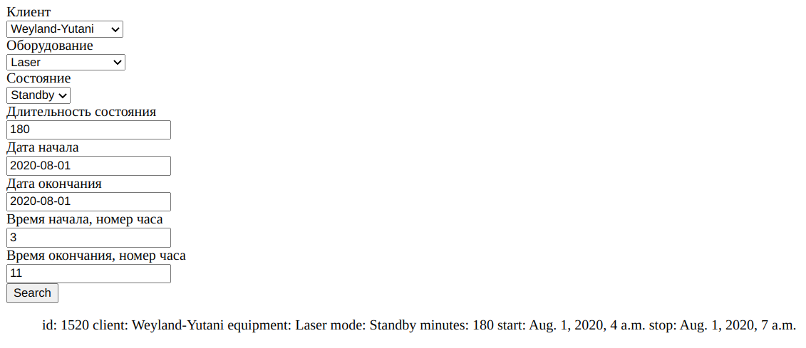

# Фильтр для базы данных

### Запуск проекта:
1. Клонировать репозиторий `https://github.com/0zzzzz/logbook_demo.git`
2. Перейти в папку с проектом, создать виртуальное окружение и ввести команду `pip install -r requirements.txt`
3. Запустить проект командой `python3 manage.py 0.0.0.0:8080`
